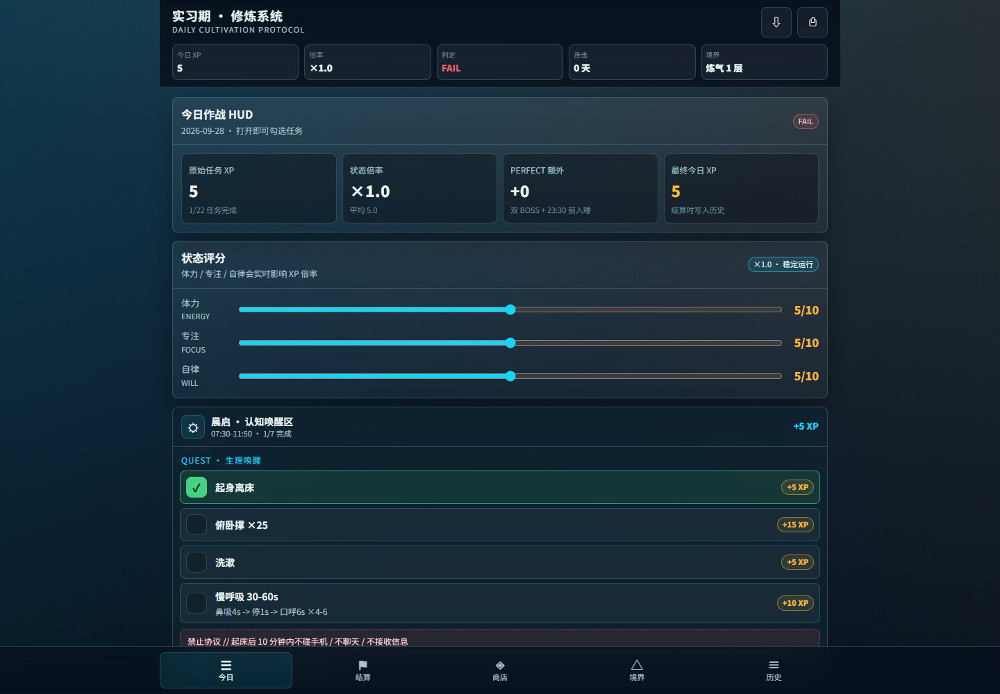
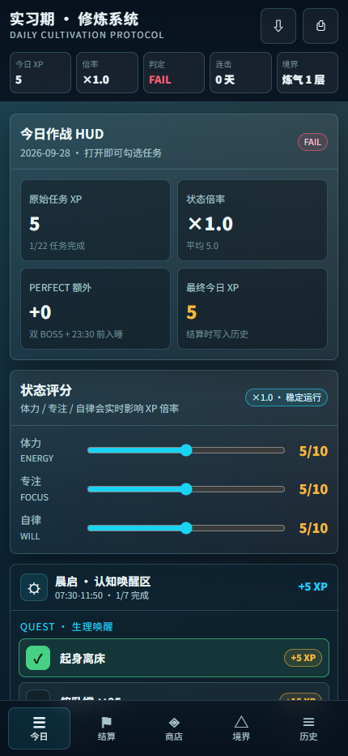
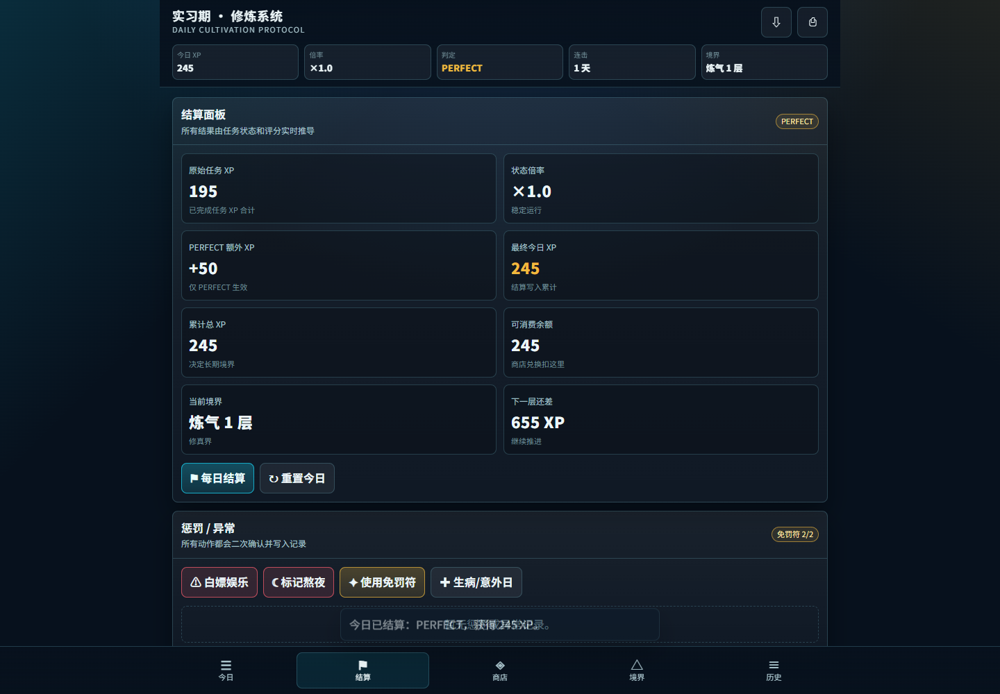
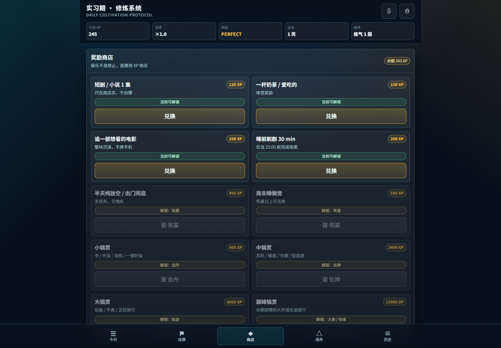
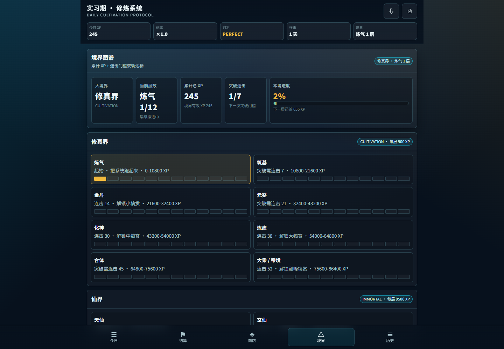

# 修炼系统 · 把每天的行动变成成长

**一个修仙风格的个人习惯与任务管理 Web App：完成现实任务获得 XP，挑战深度工作 BOSS，每晚结算，用积累的经验解锁境界与生活奖励。**

适合想建立学习、实习或工作节奏，又喜欢游戏化反馈的人。打开浏览器就能使用，无需注册；日常记录默认保存在自己的设备上。

**[立即体验](https://xiulian-system.pages.dev/)** · [快速上手](#快速上手) · [规则说明](#xp-与每日判定) · [本地运行](#本地运行) · [自定义与部署](#自定义与部署)



> 配图来自本仓库实际运行的界面。今日页展示刚开始打卡的状态，结算、商店与境界页使用临时演示数据，不包含个人历史记录。

## 它能帮你做什么

把“今天要好好学习”拆成可以执行、记录和回顾的行动：早晨启动、上午深度工作、午间恢复、下午推进、晚间收尾。每个行动有明确的 XP，两个深度工作块是当天的 BOSS。

```text
评估今日状态 → 完成分时段任务 → 挑战两个 BOSS → 每日结算
                                              ↓
                     回顾历史 ← 兑换奖励 / 积累 XP / 提升境界
```

| 功能 | 实际用途 |
| --- | --- |
| 今日任务 | 按时间段折叠展示，点击即可完成或取消，XP 实时变化 |
| 状态评分 | 记录体力、专注、自律，三项评分共同决定当天 XP 倍率 |
| 深度工作 BOSS | 上午与下午各一个专注块，突出当天最重要的工作 |
| 每日结算 | 自动计算 PERFECT / PASS / SAVE / FAIL，并写入历史 |
| 奖励商店 | 用可消费 XP 兑换奶茶、电影、休息或更大的自定奖励 |
| 境界图谱 | 在修真界、仙界、神界中成长，突破同时考察 XP 和连击 |
| 惩罚与异常 | 记录违规、熬夜、债务任务，以及特殊情况免罚 |
| 历史与数据舱 | 查看结算和兑换记录，导出、导入数据，配置可选云同步 |
| 手机与桌面 | 响应式布局、底部导航，提供 PWA 安装入口与基础离线缓存 |

奖励是你给自己的现实承诺，应用负责记录兑换，不会购买商品或支付款项。当前任务和奖励是预设配置；修改它们需要编辑源码。

## 快速上手

1. 打开 **[在线应用](https://xiulian-system.pages.dev/)**，进入底部的「今日」。
2. 根据当天状态调整体力、专注、自律评分，逐项勾选已完成的任务。
3. 在对应时间区块填写重点成果和深度工作安排，完成上午、下午两个 BOSS。
4. 晚上进入「结算」，检查 XP 与判定，点击「每日结算」保存当天结果。
5. 在「商店」兑换奖励，在「境界」查看成长进度，在「历史」回顾并备份数据。

**打卡会自动保存在本机；累计 XP 和历史记录需要执行每日结算。** 同一天再次结算会提示覆盖当天记录，不会重复叠加当天 XP。

<details>
<summary>查看手机界面</summary>

<p align="center">
  
</p>

手机浏览器可尝试「添加到主屏幕」；支持安装的桌面浏览器可使用地址栏安装入口或应用右上角安装按钮。实际安装方式取决于浏览器。首次联网加载后，Service Worker 会缓存基础页面资源，云同步仍需要网络。

</details>

## 看看主要界面

### 每日结算：让一天有明确的结果

任务 XP、状态倍率、完美奖励、累计经验和可消费余额集中展示。下图演示完成两个 BOSS 并勾选按时入睡后的 PERFECT 结算。



### 奖励商店：给坚持一个具体的回报

例如一杯奶茶需要 150 XP、一部电影需要 200 XP；更大的奖励还需要达到指定境界。兑换消耗可消费余额，累计成长 XP 与兑换余额分开计算。



### 境界图谱：看到长期积累

从炼气开始，每个小境界分 12 层。境界页展示升级进度、所需 XP 与突破的连击要求。



## XP 与每日判定

```text
任务 XP = 已完成任务的 XP 之和
基础结算 XP = 四舍五入（任务 XP × 状态倍率）
最终今日 XP = 基础结算 XP + PERFECT 奖励（50 XP）
```

体力、专注、自律的平均分决定倍率：

| 三项平均分 | 倍率 |
| --- | --- |
| ≥ 8 | ×1.2 |
| ≥ 5 且 < 8 | ×1.0 |
| ≥ 3 且 < 5 | ×0.8 |
| < 3 | ×0.6 |

每日判定按下表从上到下匹配，阈值中的 XP 指基础结算 XP，不含 PERFECT 额外奖励：

| 判定 | 条件 |
| --- | --- |
| PERFECT | 完成两个 BOSS，并完成「23:30 前熄灯入睡」；额外 +50 XP |
| PASS | 至少完成一个 BOSS，且基础结算 XP ≥ 200 |
| SAVE | 基础结算 XP ≥ 100；或原为 FAIL，但已启用当日异常保护 |
| FAIL | 不满足以上条件 |

初次打开或一天刚开始时出现 FAIL，只是根据当前勾选情况计算的即时状态；可以继续完成任务后再结算。

境界既看累计 XP，也看连击门槛。惩罚机制还会影响可消费余额、商店状态或境界进度，相关操作在界面中有确认提示。完整规则可在主 HTML 的 `computeMetrics`、`recalculateProfile` 和 `computeRealm` 中查看。

## 数据保存与多设备同步

### 默认：保存在本机

- 无需账号，任务、历史、兑换等数据保存在当前浏览器的 `localStorage` 中。
- 不同浏览器、设备或网站地址的数据相互独立。清理网站数据会删除本地记录。
- 在「历史 → 数据舱」导出 JSON 备份，需要时再导入。更换设备或修改部署地址前建议先备份。

### 可选：加密云同步

在「历史 → 数据舱」设置 Worker 地址和同步密钥，再开启自动同步。多台设备需要填写**同一个 Worker 地址与同一个密钥**。

```text
浏览器本地数据 → Web Crypto 加密 → Cloudflare Worker → KV 存储
另一台设备    ← 使用同一密钥解密 ← 拉取云端密文
```

前端使用 HKDF / SHA-256 派生密钥，通过 AES-256-GCM 加密数据；Worker 保存密文和同步元数据。同日任务及历史记录有合并逻辑，但多设备同时修改同一字段时可能发生覆盖，最好切换设备前后完成同步。

密钥保存在设备本地，请使用随机生成的密钥并自行保存；丢失后没有账号找回功能。关闭同步只会停止本机上传与拉取，**不会删除云端密文**。

前端预设了作者部署的同步服务地址。自行部署时建议创建自己的 Worker 和 KV，并修改默认地址。当前后端是轻量个人同步实现，没有账号管理、独立访问认证或限流层；密钥和同步标识应妥善保存。

进一步说明见 [同步部署说明](同步部署说明.md)。

## 本地运行

前端由原生 HTML、CSS、JavaScript 构成，无需安装 npm 依赖或构建。

```bash
git clone https://github.com/sleepwithoutawake/xiulian-system.git
cd xiulian-system
python -m http.server 8000
```

然后打开 [http://localhost:8000](http://localhost:8000)。需要已安装 Python 3；Windows 也可以使用 `py -m http.server 8000`。

主页面也可直接打开，但建议通过本地 HTTP 服务预览。PWA、离线缓存和加密能力应在 `localhost` 或 HTTPS 环境下使用。

## 项目结构

```text
xiulian-system/
├── 修炼系统_每日操作卡.html   # 主应用：界面、任务配置、XP、存储、同步
├── index.html                # 本地入口，跳转到主应用
├── manifest.json             # PWA 名称、图标、启动方式
├── sw.js                     # 根目录版本的离线缓存
├── app-icon.svg              # 应用图标
├── _headers                  # 静态托管响应头配置
├── sync-worker.js            # 可选的云同步后端
├── wrangler-sync.toml        # Worker 部署与 KV 绑定配置
├── dist/                     # 静态发布目录；主页面命名为 app.html
├── docs/images/              # README 真实界面截图
├── 同步部署说明.md           # 同步部署参考
├── 免费托管继续部署.md       # 原部署记录与地址
└── 指令.md                   # 原始产品需求
```

## 自定义与部署

### 修改任务、奖励与成长规则

编辑 `修炼系统_每日操作卡.html` 中以下配置或函数：

| 位置 | 可修改内容 |
| --- | --- |
| `zones` | 分时段任务、文案、任务 XP、BOSS 标记 |
| `rewards` | 奖励名称、花费、境界限制 |
| `realmWorlds` | 三界境界、每层 XP、连击门槛 |
| `multiplierForRatings` | 评分与 XP 倍率 |
| `computeMetrics` | 每日判定条件与完美奖励 |
| `DEFAULT_SYNC_ENDPOINT` | 默认同步服务地址 |

已有记录通过任务 ID 对应任务，自定义时尽量保持已有 ID 稳定，并先导出备份。

### 发布静态前端

`dist/` 可以交给静态网站托管服务。修改主页面后，需要先更新发布副本；仓库没有自动构建步骤。

PowerShell 示例：

```powershell
Copy-Item -LiteralPath '.\修炼系统_每日操作卡.html' -Destination '.\dist\app.html' -Force
```

图标、manifest 或响应头修改后也要同步到 `dist/`。根目录和 `dist/` 的入口文件、Service Worker 引用的主页面名称不同，不应整份直接互相覆盖；更新离线资源时同步调整缓存版本。

已有 Cloudflare Pages 部署记录见 [免费托管继续部署](免费托管继续部署.md)。自行部署请使用自己的项目与配置。

### 部署可选同步后端

创建自己的 Cloudflare Worker 与 KV namespace，将 KV 绑定名称设为 `SYNC_STORE`，把 `wrangler-sync.toml` 中的 namespace ID 替换成自己的值。随后部署 `sync-worker.js`，将得到的 Worker 地址填入应用，或修改前端默认地址。

仅在本机使用时不需要部署后端，也不需要开启同步。

## 常见问题

**为什么打卡后累计 XP 没变化？**

今日 XP 实时计算；累计 XP 由结算历史计算，需要进入「结算」点击「每日结算」。

**手机和电脑为什么没有自动一致？**

本地模式按设备和浏览器独立保存。需要在两端开启同步，并使用相同的地址和密钥。

**能在界面里添加任意任务吗？**

当前版本主要使用预设日程，支持填写重点成果与复盘；任务列表和奖励配置需要修改源码。

**这是多人游戏吗？**

这是个人自律与成长记录工具，没有联机对战、排行榜或多人账号体系。
